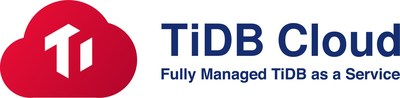

<p align="center">
  <a href="https://www.pingcap.com/tidb-cloud/"></a>
  <a href="https://www.terraform.io/"></a>
</p>

# Terraform TiDB Cloud Provider

[](https://github.com/tidbcloud/terraform-provider-tidbcloud/blob/master/LICENSE)
[](https://github.com/tidbcloud/terraform-provider-tidbcloud/releases)

This is the repository for the terraform-provider-tidbcloud, which allows one to use Terraform with TiDB Cloud. Learn more about [TiDB Cloud](https://en.pingcap.com/tidb-cloud/)

For general information about Terraform, visit the [official website](https://www.terraform.io) and the [GitHub project page](https://github.com/hashicorp/terraform).

# TOC

- [Requirements](#requirements)
- [Support](#support)
- [Quick Start](#quick-start)
- [User Guide](#user-guide)
- [Developing the Provider](#developing-the-provider)
  * [Environment](#environment)
  * [Building the provider from source](#building-the-provider-from-source)
  * [Generate or update documentation in docs file](#generate-or-update-documentation-in-docs-file)
  * [Running the acceptance test](#running-the-acceptance-test)
  * [Debug the provider](#debug-the-provider)
- [Follow us](#follow-us)
- [License](#license)

## Requirements

- [Terraform](https://www.terraform.io/downloads.html) >= 1.0
- [Go](https://golang.org/doc/install) >= 1.18 (if you want to build the provider plugin)

## Support

Resources
- [cluster](./docs/resources/cluster.md)
- [backup](./docs/resources/backup.md) (not support update)
- [restore](./docs/resources/restore.md) (not support update and delete)

DataSource
- [projects](./docs/data-sources/projects.md)
- [cluster specs](./docs/data-sources/cluster_specs.md)
- [restores](./docs/data-sources/restores.md)
- [backups](./docs/data-sources/backups.md)
- [clusters](./docs/data-sources/clusters.md)

## Quick Start

Install terraform

```
brew tap hashicorp/tap
brew install hashicorp/tap/terraform
```

Set the environment variables

```
export TIDBCLOUD_PUBLIC_KEY = "fake_public_key"
export TIDBCLOUD_PRIVATE_KEY = "fake_private_key"
```

Build a cluster.tf file:

```
terraform {
  required_providers {
    tidbcloud = {
      source = "tidbcloud/tidbcloud"
      version = "~> 0.1.0"
    }
  }
  required_version = ">= 1.0.0"
}

resource "tidbcloud_cluster" "serverless_tier_cluster" {
  project_id     = "fake_id"
  name           = "example2"
  cluster_type   = "DEVELOPER"
  cloud_provider = "AWS"
  region         = "us-east-1"
  config = {
    root_password = "Fake_root_password1"
  }
}
```

Execute the following commands to create a serverless tier

```
terraform init
terraform apply --auto-approve
```

## User Guide

See [TiDB Cloud Terraform Integration Overview](https://docs.pingcap.com/tidbcloud/terraform-tidbcloud-provider-overview) for more details.

## Developing the Provider

### Environment

If you wish to work on the provider, you'll first need [Go](http://www.golang.org) installed on your machine (see [Requirements](#requirements) above).

### Building the provider from source

1. Clone the repository
```shell
git clone git@github.com:tidbcloud/terraform-provider-tidbcloud
```
2. Enter the repository directory
```shell
cd terraform-provider-tidbcloud
```
3. Build the provider using the Go `install` command. This will build the provider and put the provider binary in the `$GOPATH/bin` directory.
```shell
go install
```

### Generate or update documentation in docs file

run `go generate`

### Running the acceptance test

see [here](./internal/README.md) for more detail.

### Debug the provider

I will introduce how to debug with Terraform CLI development overrides. About other ways to debug the provider, see [terraform official doc](https://www.terraform.io/plugin/debugging) for more detail

Development overrides is a method of using a specified local filesystem Terraform provider binary with Terraform CLI, such as one locally built with updated code, rather than a released binary.

1. create `.terraformrc` in your operating system user directory
```
provider_installation {

  dev_overrides {
      "tidbcloud/tidbcloud" = "<put your $GOPATH/bin here>"
  }

  # For all other providers, install them directly from their origin provider
  # registries as normal. If you omit this, Terraform will _only_ use
  # the dev_overrides block, and so no other providers will be available.
  direct {}
}
```

2. run go install in the terraform-provider-tidbcloud, you will find the `terraform-provider-tidbcloud` will be installed under the `$GOPATH/bin` 
```
go install
```

3. Terraform CLI commands, such as terraform apply, will now use the specified provider binary if you follow the below config:
```
terraform {
  required_providers {
    tidbcloud = {
      source = "tidbcloud/tidbcloud"
    }
  }
}
```

## Follow us

Twitter [@PingCAP](https://twitter.com/PingCAP)


## License

terraform-provider-tidbcloud is under the Apache 2.0 license. See the [LICENSE](./LICENSE) file for details.
